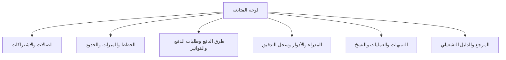
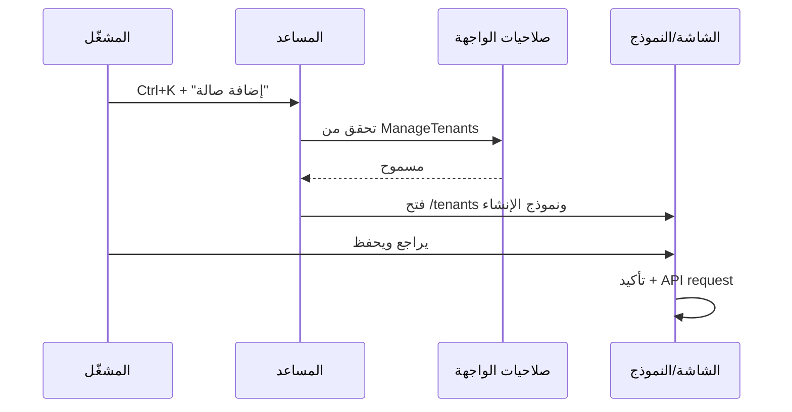
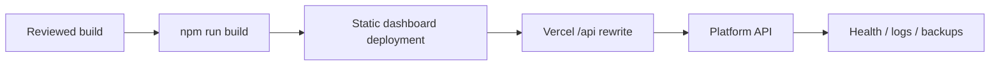

<div align="center">

# LogicFit Platform Admin Dashboard

### لوحة الإدارة المركزية لمنصة LogicFit SaaS

[](https://angular.dev/)
[](https://tailwindcss.com/)
[](https://primeng.org/)
[](https://www.typescriptlang.org/)
[](#-verification)

إدارة الصالات، خطط الـSaaS، الميزات، الحدود، الدفع اليدوي، الفواتير، التنبيهات،
النسخ الاحتياطي، الصلاحيات والعمليات الخلفية من مكان واحد.

[التشغيل](#-quick-start) · [الشاشات](#-screens) · [المساعد الذكي](#-operational-assistant) · [التوثيق](#-documentation) · [النشر](#-deployment)

</div>

---

## ما الذي يفعله هذا المشروع؟

هذه الواجهة منفصلة تماماً عن تطبيق الصالات. هي مساحة عمل `PlatformOwner` و
`PlatformAdmin` لإدارة منتج LogicFit SaaS عبر `LogicFit.Platform.API` فقط.

```mermaid
flowchart LR
    Owner[Platform Owner / Admin] --> Dashboard[Angular Admin Dashboard]
    Dashboard --> Guards[JWT + Route Permissions]
    Guards --> Proxy[/api/platform]
    Proxy --> API[LogicFit.Platform.API]
    API --> DB[(SQL Server)]
    API --> Jobs[Jobs / Outbox / Backup service]
    API --> Tenants[Gyms / Tenants]
```



## Screens

| المجال | الشاشات |
|---|---|
| المتابعة | Dashboard، Reports، Alerts، Documentation. |
| الصالات | Tenants، Subscriptions. |
| منتج الـSaaS | Plans، Features، Feature Overrides، Quota Definitions، Feature Dependencies. |
| الدفع اليدوي | Payment Methods، Payment Requests، Invoices. |
| الحوكمة | Administrators، Roles، Audit Logs. |
| التشغيل | Operations (Jobs/Outbox)، Backups. |

كل قائمة تستخدم Server-side pagination موحداً، وكل عملية حساسة تحترم الصلاحية وتأكيد
المستخدم. السجل المالي والتدقيق وJobs/Outbox وسجل النسخ ليست CRUD عاماً.

التفاصيل الكاملة لكل Route وزر ومصدر API موجودة في
[كتالوج الشاشات](docs/SCREEN-CATALOG.md).

## Operational Assistant

المساعد التشغيلي جزء من الـlayout ويظهر في كل شاشة محمية.

- افتحه من الزر العائم أو زر النجمة في الشريط العلوي أو `Ctrl/Cmd + K`.
- يشرح الشاشة الحالية: الغرض، خطوات العمل، التحذيرات، الأزرار والترقيم.
- يبحث بالعربية والإنجليزية: `إضافة صالة`، `موافقة دفع`، `نسخة احتياطية`، `صلاحيات`.
- يصفي النتائج حسب صلاحيات المستخدم.
- الإجراء السريع ينتقل إلى شاشة أو يفتح نموذجاً قائماً فقط؛ لا ينفذ Mutation صامتاً.



المساعد محلي وآمن: لا يرسل بيانات المنصة إلى LLM خارجي ولا يحتوي مفاتيح API. أي
محادثة توليدية مستقبلية تحتاج endpoint خادم وسياسة بيانات ومفتاح Secret Store.

## Permissions

| Permission | الوصول |
|---|---|
| `ManagePlatform` | وصول شامل إلى كل صلاحيات المنصة. |
| `ManageTenants` | الصالات ودورات الاشتراك. |
| `ManagePlans` | الخطط والميزات والاستثناءات والحدود والاعتماديات. |
| `ManagePaymentRequests` | طرق الدفع اليدوي وطلبات الدفع. |
| `ManagePlatformReports` | Dashboard والتقارير والتنبيهات والسجل والفواتير والحسابات والعمليات والتوثيق. |
| `ManagePlatformBackups` | إنشاء وقراءة وتنزيل النسخ الاحتياطية. |

القائمة والمساعد يخفيان ما لا يملكه المستخدم، لكن Platform API يعيد التحقق من JWT
والـPolicy في كل Endpoint.

## Architecture

```text
src/app/
├── core/
│   ├── auth/                 AuthService, guards, JWT/error interceptors, models
│   ├── layout/               Main layout, sidebar, topbar, navigation
│   ├── models/               Platform DTOs and PagedResult
│   └── services/             Storage abstraction
├── features/                 Lazy-loaded business screens
│   └── documentation/        In-dashboard searchable documentation center
└── shared/
    ├── assistant/            Contextual assistant catalog, search and commands
    └── ui/                   Page header, status badge, notifications, paginator
```

Detailed integration, auth, errors, API routing and contribution rules are in
[Architecture and integration](docs/ARCHITECTURE-AND-INTEGRATION.md).

## Design system

The interface is RTL-first and uses Tailwind with PrimeNG:

- Shared tokens and global components in `src/styles.scss`.
- Brand is blue/indigo, with semantic success/warning/danger status colors.
- `PageHeaderComponent`, `.lf-page`, `.lf-card`, `.lf-table-shell` and
  `ServerPaginatorComponent` are the standard page building blocks.
- Icon-only buttons require a Tooltip and `aria-label`; sensitive mutations require
  confirmation and a visible loading/success/error state.
- Responsive sidebar, keyboard focus, and `prefers-reduced-motion` are supported.

Read the full [Style guide](docs/STYLE-GUIDE.md) before introducing a new component.

## Quick start

### Requirements

- Node.js 20+
- npm 10+
- Reachable `LogicFit.Platform.API` for data and login

```bash
npm install
npm start
```

The development server runs at `http://localhost:4200`. Requests use the relative
`/api/platform` path and `proxy.conf.json`, so local development avoids browser CORS.

### Build

```bash
npm run build
# dist/logifit-platform-admin/browser
```

## Authentication and API connection

1. Platform login uses **email + password**, never a gym subdomain.
2. `AuthService` stores the Access Token, profile and permissions. The Refresh Token exists
   only in a server-issued HttpOnly, Secure cookie.
3. The JWT interceptor attaches Bearer authentication and sends credentials.
4. A 401 triggers one shared cookie-based token refresh; failure clears the session.
5. `environment.prod.ts` keeps `apiUrl: '/api/platform'`; Vercel rewrites `/api/*`
   to `https://logicfit-saas-model.runasp.net` through `vercel.json`.

Do not change production to a direct absolute API URL without configuring CORS at the
backend. Do not commit credentials, tokens, connection strings or publish profiles.

## Deployment



- The dashboard is static; its API availability depends on the rewrite and Platform API.
- A 401 after deployment is usually a session/permission issue.
- A 500 is an API/server issue; inspect backend logs and settings.
- A 503 in Backups means the backup service is unavailable or disabled.
- A 404 download for a listed backup often means the server runs an older Platform API
  build without the download endpoint.

## Documentation

| Document | Contents |
|---|---|
| [Complete platform documentation](docs/COMPLETE-PLATFORM-ADMIN-DOCUMENTATION.md) | كل شاشة، تدفق إنشاء المساحات، الصلاحيات، حالات النسخ وقواعد البيانات، عقد الـAPI، الاختبارات والتشغيل. |
| [Admin workspace](docs/ADMIN-WORKSPACE.md) | Pagination, CRUD/lifecycle limits and the assistant. |
| [Screen catalog](docs/SCREEN-CATALOG.md) | Every dashboard route, permission, endpoint and action. |
| [Complete screen operations guide](docs/SCREEN-OPERATIONS-GUIDE.md) | The operational purpose, data, controls, permissions and business safeguards for every dashboard screen. |
| [Architecture and integration](docs/ARCHITECTURE-AND-INTEGRATION.md) | Auth, routing, API proxy, errors, assistant and development rules. |
| [Backup and resource hardening](docs/BACKUP-RESOURCE-HARDENING-2026-08-09.md) | Selected-tenant backups, idempotency, safe downloads, retry targeting, resource filters and verification evidence. |
| [Style guide](docs/STYLE-GUIDE.md) | Tailwind/PrimeNG design contract, components and accessibility. |
| [Complete API endpoint catalog](docs/API-ENDPOINT-CATALOG.md) | All Tenant and Platform routes, access, inputs and declared responses, mirrored from the backend controller generator. |
| [Backend product documentation](../LogicFit/docs/README.md) | Product flows, Domain, full API, data, permissions and operations. |

The same material is available to authorized operators in the dashboard at
`/documentation`.

## Verification

```bash
npm run build
```

Before delivery, test login with a permitted platform account, navigation by permission,
pagination, a safe create/edit flow, an approval/rejection flow in a non-production test
case, and the `/documentation` page search.

## Contribution rules

1. Work from `develop` on a task-specific branch.
2. Do not push directly to `develop` or `main`.
3. Update relevant docs, assistant guide and API DTO/service in the same change.
4. Run `npm run build` before opening a Pull Request.

---

Built for reliable SaaS operations — with clear ownership, auditable decisions, and
tenant-safe controls.
Authentication is Email + Password only. See [docs/ISSUE-161-AUTH-FLOW.md](docs/ISSUE-161-AUTH-FLOW.md)
for the current API and refresh-cookie flow.
