# معمارية وربط لوحة إدارة LogicFit

> **حالة Issue #118:** تم الدمج في فروع `develop` للـBackend وTenant UI وPlatform UI بتاريخ 2026-08-01. لم تُصدر أو تُنشر أو تُتحقق على Production بعد.

> **Production API routing:** both `/api/*` and `/uploads/*` are rewritten by Vercel to the verified unified RunASP host `https://logicfit-saas-model.runasp.net`. The similarly named `logicfit-saas.runasp.net` host is not a valid production target and must not be reintroduced.

## الغرض والنطاق

هذه الواجهة مخصصة فقط لإدارة منصة LogicFit SaaS من قبل `PlatformOwner` و
`PlatformAdmin`. لا تستخدم API الصالات ولا تقبل `subdomain` عند تسجيل الدخول. واجهة
الصالات موجودة في مستودع مختلف وتستخدم جمهور JWT مختلفاً.

```mermaid
flowchart LR
    User[Platform Owner / Admin] --> Angular[Angular 18 Admin Dashboard]
    Angular --> Auth[AuthService + Guards]
    Auth --> Otp[Password + mandatory OTP]
    Otp --> Interceptor[JWT / HttpOnly refresh single-flight / OTP step-up]
    Interceptor --> Proxy[/api/platform rewrite or dev proxy/]
    Proxy --> API[LogicFit.Platform.API]
    API --> Domain[Application / Domain / Infrastructure]
    Domain --> SQL[(SQL Server)]
```

## طبقات الواجهة

| المجلد | المسؤولية |
|---|---|
| `src/app/core/auth` | AuthService، النماذج، guards وinterceptors. |
| `src/app/core/layout` | shell، القائمة، الشريط العلوي وعناصر التنقل حسب الصلاحية. |
| `src/app/core/models` | DTOs ونماذج Platform المشتركة. |
| `src/app/features` | شاشات الأعمال lazy-loaded. |
| `src/app/shared/ui` | PageHeader، StatusBadge، Notify، ServerPaginator. |
| `src/app/shared/assistant` | المساعد التشغيلي والكتالوج والبحث والإجراءات الآمنة. |
| `src/environments` | عنوان API ومفاتيح التخزين فقط؛ بلا أسرار. |

## المصادقة والجلسة

1. `POST /api/platform/auth/login` يفحص البريد وكلمة المرور ثم يعيد OTP challenge فقط.
   أحداث الإدخال التي لا تدعم `getModifierState` لا توقف إرسال الطلب؛ Caps Lock تحسين واجهة فقط.
2. الواجهة ترسل `challengeId + code + sessionBinding` إلى
   `POST /api/platform/auth/otp/verify`. لا تصدر جلسة Platform قبل نجاح الخطوتين.
3. تحفظ الواجهة Access Token وبيانات المستخدم والصلاحيات فقط. Refresh Token يكتبه
   الخادم في Cookie آمنة `HttpOnly; Secure; SameSite=None` ولا يقرأها JavaScript.
4. `jwt.interceptor` يضيف Bearer Token ويرسل credentials مع طلبات API.
5. عند انتهاء Access Token تشارك الطلبات المتزامنة عملية refresh واحدة (`single-flight`).
6. فشل refresh يمسح الجلسة ويعيد إلى `/auth/login`.
7. العمليات الحساسة في tenants/plans/roles/workspace applications تعيد `403` عند غياب
   step-up؛ `otpStepUpInterceptor` يفتح Dialog، يطلب/يتحقق من OTP، ثم يعيد الطلب مرة
   واحدة مع `X-LogicFit-OTP-Step-Up` و`X-Session-Id`.
8. `authGuard` يحمي الـshell و`permissionGuard` يحمي كل Route؛ API يكرر التحقق كحاجز
   أمني فعلي.
9. Issue #127 يضيف وضع اختبار مستضاف مؤقتًا بكود `1234`. الواجهة تعرض تلميحًا فقط؛ الخادم
   ينشئ challenge حقيقيًا ويطبّق الـHash والحدود والاستهلاك الذري وتاريخ انتهاء الاستثناء.

`ManagePlatform` يمنح كل الصلاحيات؛ غيره يرى فقط الشاشات التي تحقق
`AuthService.hasAnyPermission`.

## الربط المحلي والإنتاجي

| البيئة | `apiUrl` | كيف يعمل؟ |
|---|---|---|
| Development | `/api/platform` | `proxy.conf.json` يمرر الطلب إلى Platform API؛ المتصفح لا يحتاج CORS. |
| Production | `/api/platform` | `vercel.json` يعيد كتابة `/api/*` إلى `https://logicfit-saas-model.runasp.net`. |

لا تغيّر production إلى عنوان مطلق إلا إذا أضيف نطاق الواجهة إلى CORS في API. العنوان
التشغيلي للخادم موجود في `platformApiUrl` للمرجع، بينما الطلبات الفعلية تبقى relative
لتستفيد من proxy/rewrite.

## قواعد البيانات في الواجهة

- كل قائمة API تستقبل `page` و`pageSize` وتعرض `PagedResult<T>`.
- `ServerPaginatorComponent` هو المكون الإلزامي للقوائم؛ أحجام الصفحة 10/20/50/100.
- لا تنفذ Sorting/Filtering محلياً على بيانات لم تحمل كاملة.
- تقرأ الشاشات المالية والتدقيق والعمليات والنسخ سجلات تاريخية فقط، ولا تضيف CRUD
  عاماً إليها.

## معالجة الأخطاء

| الرمز | التصرف في الواجهة | تصرف المشغّل |
|---|---|---|
| 400 | عرض رسالة تحقق مفهومة. | صحح مدخلات النموذج. |
| 401 | محاولة refresh ثم logout عند الفشل. | تحقق من الجلسة والصلاحيات. |
| 403 | في mutation حساس يبدأ OTP step-up؛ بعده تظهر رسالة عدم صلاحية إن ظل الرفض. | أكمل OTP أو راجع الدور؛ OTP لا يمنح Permission جديدة. |
| 404 | المورد/الـEndpoint غير موجود. | تحقق من اسم المورد أو إصدار API المنشور. |
| 409 | تعارض عمل مثل حذف خطة مستخدمة أو نسخة طلب قديمة. | أعد قراءة السجل واتبع دورة الحياة. في اعتماد المدرب الحر، رسالة تهيئة الأدوار تعني تطبيق Migration `SeedFreelanceSystemRoles` وليس إعادة المحاولة العشوائية. |
| 500/503 | رسالة عامة بلا كشف تفاصيل. | راجع Logs وإعدادات API/الخدمة. |

## المساعد التشغيلي

`AdminAssistantComponent` يحقن في `MainLayoutComponent`، لذلك هو متاح في كل Route
محمٍ. كتالوجه يحتوي دليل كل شاشة: وصف، خطوات، تحذيرات، زرار، وإجراءات سريعة.

- `Ctrl/Cmd + K` أو زر النجمة أو الزر العائم يفتح المساعد.
- البحث يطبع العربية ويطابق عناوين الشاشات والأوصاف والكلمات المفتاحية.
- النتائج تصفى حسب الصلاحية قبل عرضها.
- الإجراء السريع ينقل للـRoute أو يفتح نموذجاً موجوداً؛ لا ينفذ mutation مباشرة.
- الأمر `refresh` يعيد تحميل الجلسة الحالية فقط؛ عملياً لا يغير بيانات الخادم.

## إضافة شاشة أو عملية جديدة

1. أضف route lazy-loaded محمياً بالـPermission الصحيحة.
2. أضف عنصر nav إن كان مناسباً للمشغّل.
3. استخدم `PageHeader`، primitives التصميم و`ServerPaginator` للقوائم.
4. أضف/حدّث service وDTO والعقد مع Backend.
5. أضف `AssistantGuide` للكشف والشرح والإجراء الآمن.
6. حدّث `SCREEN-CATALOG.md` و`ADMIN-WORKSPACE.md` وREADME عند تغير المستخدم أو API أو التصميم.
7. شغّل `npm run build` قبل التسليم.

## تكامل مراجعة طلبات مساحة العمل

`WorkspaceApplicationsService` يتصل فقط بـ`/api/platform/workspace-applications` عبر interceptor منصة الإدارة. لا يرسل `TenantId` من المتصفح ولا يحاول تنفيذ قرارات محلية. يمرر كل mutation `rowVersion` الذي أعاده الخادم، ويعتمد حالة الصف الجديدة من الاستجابة. أما مقدم الطلب فيستخدم Tenant API العامة `/api/identity` و`/api/workspace-applications` مع Tracking Token قصير العمر، لا Platform JWT.

## الكتالوج الكامل لعقود API

[API-ENDPOINT-CATALOG.md](API-ENDPOINT-CATALOG.md) يحتوي كل endpoints في Tenant API
وPlatform API، بما فيها route وHTTP method والصلاحية والمدخلات والاستجابة المعلنة.
إنه مرآة للملف المولّد من الـControllers في مشروع Backend؛ لا تعتمد على قائمة يدوية
عند إضافة أو تغيير عقد. حدّثه من `LogicFit/Scripts/Export-ApiEndpointCatalog.ps1`
في نفس التغيير.
