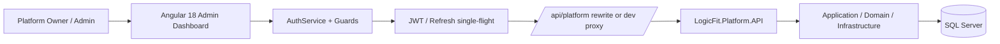

# معمارية وربط لوحة إدارة LogicFit

## طبقة مراكز التنقل

يستخدم MainLayoutComponent قائمة مختصرة من مراكز الواجهة، ويعرض
AdminSectionHubComponent بطاقات الوحدات التابعة. هذا يقلل ازدحام القائمة دون إنشاء
تطبيقات منفصلة أو نسخ من المكونات؛ الصفحات التشغيلية والخدمات الحالية تبقى lazy-loaded
على مساراتها الأصلية. كل بطاقة تُفلتر حسب صلاحيتها، بينما يظل Route Guard والـPlatform
API مصدر القرار النهائي. البحث في القائمة يضيف المسارات الثانوية إلى نتائج البحث فقط،
ولا يغيّر الصلاحيات.

## الغرض والنطاق

هذه الواجهة مخصصة فقط لإدارة منصة LogicFit SaaS من قبل `PlatformOwner` و
`PlatformAdmin`. لا تستخدم API الصالات ولا تقبل `subdomain` عند تسجيل الدخول. واجهة
الصالات موجودة في مستودع مختلف وتستخدم جمهور JWT مختلفاً.

## طبقات الواجهة

| المجلد | المسؤولية |
|---|---|
| `src/app/core/auth` | AuthService، النماذج، guards وinterceptors. |
| `src/app/core/layout` | shell، القائمة، الشريط العلوي وعناصر التنقل حسب الصلاحية. |
| `src/app/core/models` | DTOs ونماذج Platform المشتركة. |
| `src/app/features` | شاشات الأعمال lazy-loaded. |
| `src/app/shared/ui` | PageHeader، StatusBadge، Notify، ServerPaginator. |
| `src/app/shared/assistant` | المساعد التشغيلي والكتالوج والبحث والإجراءات الآمنة. |
| `src/environments` | عنوان API ومفاتيح التخزين فقط؛ بلا أسرار. |

## المصادقة والجلسة

1. `POST /api/platform/auth/login` بالبريد وكلمة المرور.
2. تحفظ الواجهة Access Token وRefresh Token وبيانات المستخدم والصلاحيات في التخزين
   المحلي بأسماء `logifit_platform_*`.
3. `jwt.interceptor` يضيف Bearer Token لكل API محمي.
4. عند انتهاء Access Token تشارك الطلبات المتزامنة عملية refresh واحدة (`single-flight`).
5. فشل refresh يمسح الجلسة ويعيد إلى `/auth/login`.
6. `authGuard` يحمي الـshell و`permissionGuard` يحمي كل Route؛ API يكرر التحقق كحاجز
   أمني فعلي.

`ManagePlatform` يمنح كل الصلاحيات؛ غيره يرى فقط الشاشات التي تحقق
`AuthService.hasAnyPermission`.

## الربط المحلي والإنتاجي

| البيئة | `apiUrl` | كيف يعمل؟ |
|---|---|---|
| Development | `/api/platform` | `proxy.conf.json` يمرر الطلب إلى Platform API؛ المتصفح لا يحتاج CORS. |
| Production | `/api/platform` | `vercel.json` يعيد كتابة `/api/*` إلى `https://logicfit-saas-model.runasp.net`. |

لا تغيّر production إلى عنوان مطلق إلا إذا أضيف نطاق الواجهة إلى CORS في API. العنوان
التشغيلي للخادم موجود في `platformApiUrl` للمرجع، بينما الطلبات الفعلية تبقى relative
لتستفيد من proxy/rewrite.

## قواعد البيانات في الواجهة

- كل قائمة API تستقبل `page` و`pageSize` وتعرض `PagedResult<T>`.
- `ServerPaginatorComponent` هو المكون الإلزامي للقوائم؛ أحجام الصفحة 10/20/50/100.
- لا تنفذ Sorting/Filtering محلياً على بيانات لم تحمل كاملة.
- تقرأ الشاشات المالية والتدقيق والعمليات والنسخ سجلات تاريخية فقط، ولا تضيف CRUD
  عاماً إليها.
- شاشة `/database-resources` تستخدم `GET /api/platform/database-resources` وتعرض اسم قاعدة
  البيانات وmetadata الخادم الآمنة و`hasProtectedConnection` والتشخيص المحفوظ؛ لا تقرأ أو تعرض
  مادة الاتصال. يستدعي التسجيل `POST /api/platform/database-resources`، واختبار قيمة جديدة
  `POST /api/platform/database-resources/test-connection`، وفحص القيمة المحفوظة
  `POST /api/platform/database-resources/{id}/test-connection`. يستدعي الإصلاح والترحيلات
  وفحص الصحة والنسخ نقاط الخادم المحمية، بينما `DELETE /api/platform/database-resources/{id}`
  حذف نهائي مشروط يعيده الخادم فقط للمورد غير المستخدم. يشفر الخادم القيمة ولا يعيدها؛ ويظل
  التخصيص والنسخ تحت سلطة الخادم.

## تكامل النسخ الاحتياطي

شاشة `/backups` تستعمل عقود Platform API الحالية: `POST /batch` لبدء scope، و`GET /batches`
للتاريخ، و`POST /batches/{id}/retry` للمحاولات الفاشلة أو الجزئية، و`GET /restores/capabilities`
لعرض قدرة مزود الاستعادة. `FullSystem` و`AllTenants` يحلان أهداف Tenant في الخادم من
`TenantDatabaseMapping`؛ لا تعتمد الواجهة على أسماء قواعد البيانات أو connection material.

تبدأ الشاشة بوضع `workspace` لنسخة مساحة عمل واحدة: تختار الواجهة Tenant واحدًا فقط وتستعمل
`SelectedTenants`، وتعرض `workspaceType` وبيانات المورد المحمي قبل السماح بالبدء. وضع `platform`
منفصل للنطاقات الجماعية (`Platform`, `AllGyms`, `AllFreelance`, `AllTenants`, `FullSystem`).
يعيد `BackupArtifactDto` بيانات عرض آمنة (`TenantName`, `WorkspaceIdentifier`, `WorkspaceType`)
لتمييز الملف في التاريخ؛ لا يعيد اسم قاعدة البيانات أو سلسلة الاتصال.

العقد يعيد checksum `Sha256` لكل artifact ومرجع manifest آمن. السجل immutable، وبدء/انتهاء
الـbatch يضاف إلى Audit Log. الواجهة لا تنفذ restore؛ حالة `ManualOnly` تعني handoff للمشغل.

## معالجة الأخطاء

| الرمز | التصرف في الواجهة | تصرف المشغّل |
|---|---|---|
| 400 | عرض رسالة تحقق مفهومة. | صحح مدخلات النموذج. |
| 401 | محاولة refresh ثم logout عند الفشل. | تحقق من الجلسة والصلاحيات. |
| 403 | رسالة عدم صلاحية. | راجع الدور من شاشة الأدوار. |
| 404 | المورد/الـEndpoint غير موجود. | تحقق من اسم المورد أو إصدار API المنشور. |
| 409 | تعارض عمل مثل حذف خطة مستخدمة. | أعد قراءة السجل واتبع دورة الحياة. |
| 500/503 | رسالة عامة بلا كشف تفاصيل. | راجع Logs وإعدادات API/الخدمة. |

## المساعد التشغيلي

`AdminAssistantComponent` يحقن في `MainLayoutComponent`، لذلك هو متاح في كل Route
محمٍ. كتالوجه يحتوي دليل كل شاشة: وصف، خطوات، تحذيرات، زرار، وإجراءات سريعة.

- `Ctrl/Cmd + K` أو زر النجمة أو الزر العائم يفتح المساعد.
- البحث يطبع العربية ويطابق عناوين الشاشات والأوصاف والكلمات المفتاحية.
- النتائج تصفى حسب الصلاحية قبل عرضها.
- الإجراء السريع ينقل للـRoute أو يفتح نموذجاً موجوداً؛ لا ينفذ mutation مباشرة.
- الأمر `refresh` يعيد تحميل الجلسة الحالية فقط؛ عملياً لا يغير بيانات الخادم.

## إضافة شاشة أو عملية جديدة

1. أضف route lazy-loaded محمياً بالـPermission الصحيحة.
2. أضف عنصر nav إن كان مناسباً للمشغّل.
3. استخدم `PageHeader`، primitives التصميم و`ServerPaginator` للقوائم.
4. أضف/حدّث service وDTO والعقد مع Backend.
5. أضف `AssistantGuide` للكشف والشرح والإجراء الآمن.
6. حدّث `SCREEN-CATALOG.md` و`ADMIN-WORKSPACE.md` وREADME عند تغير المستخدم أو API أو التصميم.
7. شغّل `npm run build` قبل التسليم.

## تكامل مراجعة طلبات مساحة العمل

`WorkspaceApplicationsService` يتصل فقط بـ`/api/platform/workspace-applications` عبر interceptor منصة الإدارة. لا يرسل `TenantId` من المتصفح ولا يحاول تنفيذ قرارات محلية. يمرر كل mutation `rowVersion` الذي أعاده الخادم، ويعتمد حالة الصف الجديدة من الاستجابة. أما مقدم الطلب فيستخدم Tenant API العامة `/api/identity` و`/api/workspace-applications` مع Tracking Token قصير العمر، لا Platform JWT.

مراجعة إثبات الدفع في شاشة الطلبات تستخدم `PaymentRequestsService` المشترك: المعاينة الحالية عبر
`GET /api/platform/payment-requests/{id}/proof`، سجل الإصدارات عبر `.../{id}/proofs`، والإصدار
التاريخي عبر `?version=N`. رفع أو استبدال الإثبات يرسل `multipart/form-data` باسم `proof` إلى
`POST .../{id}/proof`. الواجهة لا تبني رابط تخزين ولا تعرض storage key؛ الخادم يتحقق من النوع
والحجم وchecksum ويحفظ النسخة القديمة. اعتماد الدفع منفصل عن `approve-workspace`، والخادم هو
الحاجز النهائي في الحالتين.

إنشاء مساحة عمل من لوحة الإدارة لا يرفع إثباتًا تلقائيًا؛ فهو ينشئ طلبًا ودفعًا معلّقًا فقط. لذلك
توجّه شاشة `/workspace-applications` المسؤول إلى رفع الإثبات بعد الإنشاء مباشرة، أو بعد إغلاق نافذة
بيانات الدخول المؤقتة عند إنشاء هوية جديدة. هذا تغيير UX فقط ولا يغيّر عقد الـAPI أو فصل صلاحيات اعتماد
الدفع عن اعتماد مساحة العمل.

## الكتالوج الكامل لعقود API

[API-ENDPOINT-CATALOG.md](API-ENDPOINT-CATALOG.md) يحتوي كل endpoints في Tenant API
وPlatform API، بما فيها route وHTTP method والصلاحية والمدخلات والاستجابة المعلنة.
إنه مرآة للملف المولّد من الـControllers في مشروع Backend؛ لا تعتمد على قائمة يدوية
عند إضافة أو تغيير عقد. حدّثه من `LogicFit/Scripts/Export-ApiEndpointCatalog.ps1`
في نفس التغيير.
# 2026-08-13 screen/API resilience (Issues #88 and #290)

Platform list screens remain cross-tenant reads only on the server. Tenant rows are paged first;
member counts are fetched in a separate explicitly unfiltered query and merged into the bounded
page. This avoids fragile correlated EF translation while tenant-scoped application APIs remain
isolated. The UI consumes the stable `items`/`totalCount` page contract.
